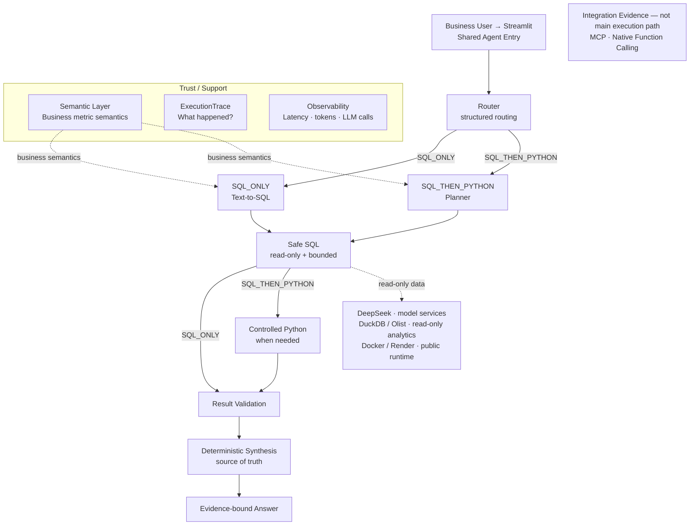

# Data Analysis Agent

面向电商运营与业务人员的**可验证多工具数据分析 Agent**，产品界面名称为
“电商数据分析助手”。用户可以用中文或英文提出经营分析问题；系统通过
Semantic Layer、受控 SQL/Python、结果校验和证据追踪，降低 SQL 能执行但指标
口径、Join grain 或数据范围实际错误的风险。

这不是消费者客服 Agent，也不只是一个 Text-to-SQL Demo。项目关注的问题是：
**如何让自然语言问数的执行过程可追溯，并在数据或能力不足时不编造答案。**

## Live Demo

**[打开 Streamlit Public Demo](https://data-analysis-agent-t32x.onrender.com)**

Public V1 部署在 Render，面向业务用户提供中文 Streamlit 界面。Render Free
instance 可能因空闲而休眠，首次访问冷启动通常需要几十秒。

## Why this project

LLM 生成一条语法正确的 SQL，并不代表业务答案正确。常见风险包括：

- 平均值的统计粒度或分母错误；
- `order_items` 与 `order_payments` 直接 Join 导致金额重复；
- “配送天数”被实现为整数日历边界，而不是精确经过时长；
- 查询返回了完整排名，而不是用户要求的 Top-N；
- 数据集根本没有库存、成本或营销归因字段，模型却仍给出结论。

本项目将指标定义、查询约束、安全执行、结构化校验和确定性答案组合成一条
governed workflow。目标不是承诺绝对正确，而是减少不可见错误、保留失败证据，
并让答案能够回溯到 SQL、数据和执行路径。

## What it can do

- 接收中文或英文自然语言业务问题，并返回中文 `zh-CN` 或英文答案；
- 使用 structured JSON Router 选择 `SQL_ONLY` 或
  `SQL_THEN_PYTHON`；
- 生成 DuckDB SQL，并对可修复的 SQL-only 错误最多尝试一次 repair；
- 执行统一的 read-only、single-statement、bounded Safe SQL；
- 在 SQL 准备数据后运行 allow-listed Python 分析：
  `describe`、`correlation`、`calculate_growth`；
- 将 Metric Definitions 与 Query Constraints 注入 SQL generation 和
  planning；
- 对执行结果进行 deterministic structural/result validation；
- 以 Deterministic Synthesis 作为答案 source of truth，再选择性生成
  evidence-bound natural-language presentation；
- 通过 ExecutionTrace 暴露执行过程，通过 Observability 记录 latency、
  token usage、LLM calls、route 和 status；
- 提供 Streamlit 业务界面和 FastAPI developer/integration entry。

## Architecture



- 默认生产入口使用 **Explicit Python Workflow**；LangGraph 是复用相同业务
  components 的 alternative orchestration。
- Router 使用 LLM structured JSON output，不使用 Native Function Calling
  作为当前路由协议。
- `SQL_ONLY` 不经过 Python；只有 `SQL_THEN_PYTHON` 将 SQL 结果交给
  Controlled Python。
- MCP 与 Native Function Calling 是独立 integration evidence，不在正式主链中。

[查看 Detailed Architecture](docs/architecture.md)

## Reliability / Trust Design

### Semantic Layer

当前 Semantic Layer V2 是一个小型、显式、可测试的业务语义目录，而不是完整的
企业级 semantic platform。

| 类型 | 当前正式 identifier |
|---|---|
| Metric Definition | `average_review_score` |
| Metric Definition | `average_items_per_order` |
| Metric Definition | `average_delivery_duration_days` |
| Query Constraint | `explicit_top_bottom_n` |

例如，`average_delivery_duration_days` 明确要求先按订单计算：

```text
DATE_DIFF('second', order_purchase_timestamp, order_delivered_customer_date)
/ 86400.0
```

再求平均；整数 calendar-day difference 不是等价实现。Metric population、
grain、aggregation、NULL 和 time semantics 会进入 SQL generation 与 Planner
prompt，而不是完全交给模型自由解释。

### Two controlled execution paths

```text
SQL_ONLY
question → Router → Text-to-SQL → Safe SQL
         → optional one-shot repair → Validation

SQL_THEN_PYTHON
question → Router → Planner → Safe SQL
         → Controlled Python → Validation
```

Controlled Python 只消费 SQL 已经整理好的表格数据，不访问数据库、不读文件，
也不执行模型生成的任意 Python code。

### Safe SQL boundary

所有 generated/repaired SQL 都经过同一个 executor：

- 只接受一条 `SELECT` 或 `WITH ... SELECT`；
- 使用 DuckDB `read_only=True`；
- 禁止 external access，并关闭 extension autoload/autoinstall；
- 默认最多向 Python 应用层返回 `DEFAULT_MAX_ROWS = 200` 行。

数据模型另外提供订单级 item/payment summary views；多表金额分析必须先聚合再
连接，避免 one-to-many Join 放大。这是 metric/grain 约束，不伪装成 executor
能够自动证明的语义。

### Validation and answer generation

Result Validation 检查 pipeline、SQLResult、PythonResult 和 growth series 等
结构及结果一致性；它**不声称证明所有业务语义都正确**。

通过校验后，Deterministic Synthesis 生成正式 evidence，作为 source of truth。
可选的自然语言模型只能基于该 evidence 做受约束表达，不重新计算指标或引入新
数字。模型调用失败或输出异常时，系统回退到 deterministic answer。

## Evaluation

项目保留一套 18 题 frozen held-out evaluation，并保存首次正式运行结果：
[`evaluation/held_out/first_run_0e8def2.json`](evaluation/held_out/first_run_0e8def2.json)。

| 指标 | 历史 frozen 结果 |
|---|---:|
| Overall | **16/18 (88.89%)** |
| Disposition | **17/18 (94.44%)** |
| Route | **14/14 (100%)** |
| Tool operation | **14/14 (100%)** |
| Semantic correctness | **12/14 (85.71%)** |

失败案例被保留，而不是从报告中删除：

- **MTQ-010**：route 正确，但 SQL generation 返回了异常的 structured model
  output（JSON 后存在 extra data），最终 disposition 为 `unknown`。
- **MTQ-013**：route 与 `calculate_growth` operation 正确，但配送时长使用
  calendar-day difference，未使用 exact elapsed seconds / `86400.0`，因此
  semantic check 失败。

Semantic Layer V2 后续明确加入了配送时长规则，但没有重跑旧 frozen held-out
并宣称 18/18。历史失败保持不变，用于展示 failure preservation 和可复现的
evaluation discipline。

## Example Questions

- `2017 年取消了多少订单？`（已验证业务结果：**265**）
- `商品成交金额最高的前 5 个商品类别是什么？`
- `商品成交金额每个月的环比变化怎么样？`

这些是 UI 中的代表性问题，不是 hard-coded query；问题仍会经过 Router、工具执行
和 Validation。

## Running Locally

要求 Python 3.11+，开发基线为 Python 3.12。

```bash
git clone https://github.com/5456465/data-analysis-agent.git
cd data-analysis-agent
python -m venv .venv
```

激活虚拟环境：

```bash
# Linux / macOS
source .venv/bin/activate
```

```cmd
:: Windows CMD
.venv\Scripts\activate
```

安装开发依赖：

```bash
python -m pip install -e ".[dev]"
```

数据库默认路径是 `data/processed/olist.duckdb`。选择一种准备方式：

```bash
# Option A：下载并严格校验公开的 data-v1 DuckDB artifact
python scripts/stage_database.py

# Option B：将九个原始 Olist CSV 放入 data/raw/ 后本地构建
python scripts/build_duckdb.py
```

通过环境变量或根目录下未跟踪的 `.env` 提供 DeepSeek credential：

```text
DEEPSEEK_API_KEY=<your-key>
```

启动 Streamlit：

```bash
python -m streamlit run app.py
```

运行测试：

```bash
python -m pytest
```

## Docker

一个 `python:3.12-slim` image 同时支持两个入口，默认 CMD 启动 Streamlit：

```bash
docker build -t data-analysis-agent:v1 .
docker run --rm -p 8501:8501 --env DEEPSEEK_API_KEY data-analysis-agent:v1
```

使用同一 image 通过 command override 启动 FastAPI：

```bash
docker run --rm -p 8000:8000 --env DEEPSEEK_API_KEY \
  data-analysis-agent:v1 \
  python -m uvicorn data_analysis_agent.api:app --host=0.0.0.0 --port=8000
```

DuckDB 不进入普通 Git。Docker build 读取
[`deployment/olist_duckdb_artifact.json`](deployment/olist_duckdb_artifact.json)，
从固定 GitHub Release `data-v1` 下载 `olist.duckdb`，验证精确 size 与
SHA-256 后写入 image：

- Size: `77,869,056 bytes`
- SHA-256:
  `74b7d398fdc5a7674d807ca00ccede091f7056b33c3213748b39068499add0c8`

实现见 [`scripts/stage_database.py`](scripts/stage_database.py)。运行中的容器
不会下载数据库。

## API

FastAPI 是 developer/integration entry；Public Render V1 只部署 Streamlit。

```bash
python -m uvicorn data_analysis_agent.api:app --host=0.0.0.0 --port=8000
```

| Endpoint | 用途 |
|---|---|
| `GET /health` | 进程 liveness，不调用 Agent 或外部 provider |
| `POST /analyze` | 执行一次共享 Agent workflow，返回答案、validation、evidence 与 observability |

`POST /analyze` 请求体示例：

```json
{"question": "2017 年取消了多少订单？"}
```

## Integration Evidence

这些能力证明现有 governed tools 可以通过标准协议复用，但不替换正式 Router 或
默认 workflow。

### MCP stdio

```bash
python -m data_analysis_agent.mcp_server
```

MCP Server 只暴露三个 read-only tools：

- `inspect_schema`
- `run_readonly_sql`
- `get_metric_definition`

数据库路径由 server startup 层绑定（可用
`DATA_ANALYSIS_AGENT_DB_PATH` 配置），caller 无法通过 tool arguments 修改
数据库路径或提高 SQL row limit。

### Native Function Calling spike

独立 spike 只暴露 `run_readonly_sql`，并真实验证了：

```text
Chat Completions tools
→ message.tool_calls
→ strict argument validation
→ governed run_readonly_sql
→ role="tool" + original tool_call_id
→ second completion
```

真实 DeepSeek smoke 使用“2017 年取消了多少订单？”并得到 **265**。这是
integration spike；生产 Router 仍使用 structured JSON routing。

## ExecutionTrace and Observability

| 能力 | 回答的问题 | 主要内容 |
|---|---|---|
| ExecutionTrace | What happened? | route、generated/repaired SQL、Planner、Python operation、Validation、Synthesis |
| Observability | How slow / expensive was it? | request_id、total/stage latency、LLM calls、tokens、route、status |

ExecutionTrace 面向结果可追溯性；Observability 是 request-scoped telemetry。
普通 Streamlit UI 不包含独立技术监控 dashboard。

## Data & Boundaries

唯一数据集是
[Brazilian E-Commerce Public Dataset by Olist](https://www.kaggle.com/datasets/olistbr/brazilian-ecommerce/data)，
包含 **99,441** 个订单，主要覆盖 2016–2018 年。

当前 DuckDB 包含八张核心业务表：

`customers`、`orders`、`order_items`、`order_payments`、
`order_reviews`、`products`、`sellers`、
`product_category_translation`。

另有订单级 item/payment 安全聚合 views 与官方品类英文映射 view。
`geolocation` 原始数据经过审计，但未进入当前 DuckDB。

数据不足以可靠回答以下问题：

- inventory / stock snapshot；
- advertising channel、campaign attribution 或 ad spend；
- product cost、profit 或 margin；
- cancellation reason；
- complete return / refund reason。

这些请求在 held-out evaluation 中属于 `data_unanswerable`，预期行为是拒绝并说明
缺失事实，而不是猜测。Forecasting、clustering 等超出 allow-listed tool set 的
请求则属于 `capability_unsupported`。

多表金额口径必须先分别将 `order_items` 和 `order_payments` 聚合到
`order_id` grain，再连接 monetary values。详细来源、审计和限制见
[`docs/DATASET.md`](docs/DATASET.md) 与
[`docs/DATA_AUDIT.md`](docs/DATA_AUDIT.md)。

## Deployment

Public V1 的运行链是：

```text
Public User → Render → Docker → Streamlit
```

DuckDB 在 Docker build 阶段校验并进入 image；DeepSeek credential 仅通过 Render
runtime secret/environment 注入，不写入 Dockerfile 或 image。Public URL：
[https://data-analysis-agent-t32x.onrender.com](https://data-analysis-agent-t32x.onrender.com)。

Render Free instance 会 idle spin down，因此冷启动延迟是当前部署层限制。

## Project Structure

```text
.
├── app.py                         # Streamlit business UI
├── Dockerfile                     # Streamlit default / FastAPI override image
├── deployment/                    # Versioned DuckDB artifact manifest
├── docs/                          # Architecture, dataset and audit documents
├── evaluation/held_out/           # Preserved frozen evaluation result
├── scripts/                       # Dataset build/audit and artifact staging
├── src/data_analysis_agent/
│   ├── tool_router.py             # structured JSON routing
│   ├── analysis_planner.py        # SQL-to-controlled-Python planning
│   ├── sql_generator.py
│   ├── sql_repair.py
│   ├── sql_executor.py            # governed read-only execution
│   ├── metric_catalog.py          # Semantic Layer V2
│   ├── python_analysis.py         # allow-listed deterministic operations
│   ├── result_validation.py
│   ├── answer_synthesis.py
│   ├── execution_trace.py
│   ├── observability.py
│   ├── api.py
│   ├── integration_tools.py
│   ├── mcp_server.py
│   ├── function_calling_spike.py
│   └── langgraph_workflow.py
└── tests/
```

## Known Limitations

- Olist 是 2016–2018 年的历史数据，不能代表当前电商市场。
- Semantic Layer 只覆盖精选指标和查询约束，不是完整 BI semantic catalog。
- Result Validation 能发现结构和部分结果异常，但不能证明所有 business semantic
  correctness。
- Router、SQL/Planner 和可选自然语言表达依赖 DeepSeek API 与网络可用性。
- Safe SQL 限制返回行数，但当前没有查询 timeout、资源配额或异步取消。
- Public Demo 是 single-user / low-traffic portfolio deployment，并受 Render Free
  cold start 影响。
- 当前不支持任意 Python、forecasting、clustering、通用 machine learning、
  multi-agent 或用户权限系统。

## License

项目源代码使用 [MIT License](LICENSE)。

Olist 数据单独使用 **CC BY-NC-SA 4.0**；MIT License 不覆盖数据。数据使用者仍需
遵守原始来源页面与数据许可证要求。
