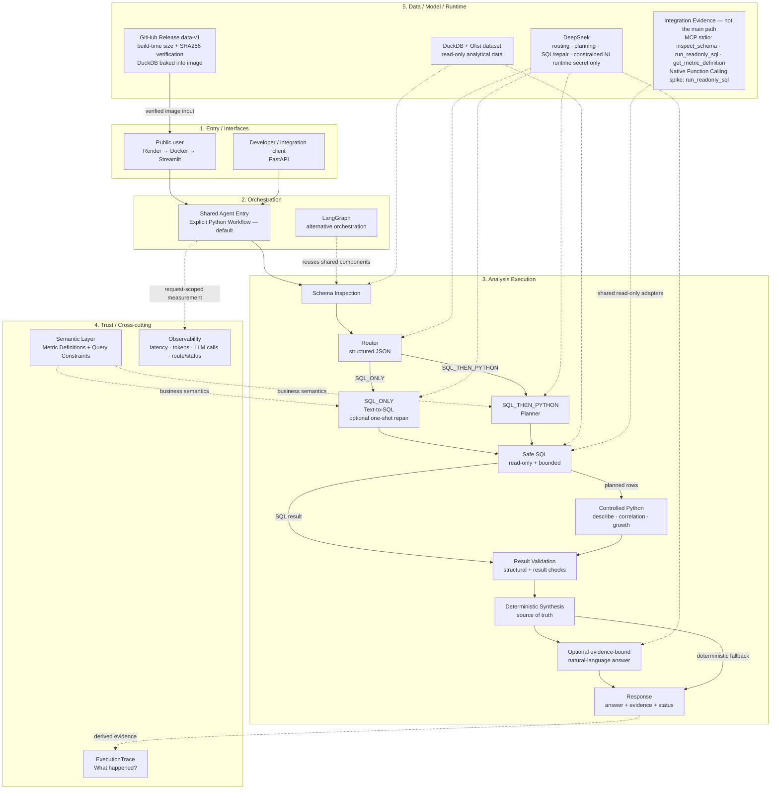

# Architecture

The public product uses the explicit Python workflow. LangGraph is an optional
orchestration over the same business components, while MCP and Native Function
Calling remain separate integration evidence.

## Reading the diagram

- The default code-level entry chain is
  `answer_question_for_user` → `answer_question_with_validation` →
  `answer_question_with_tools`. Streamlit and FastAPI both use this chain.
- The SQL-only path generates SQL and may make one repair attempt after an
  eligible execution error. Every initial or repaired query crosses the same
  read-only, row-bounded SQL executor.
- The SQL-then-Python path uses SQL to prepare bounded tabular input, then runs
  one allow-listed deterministic operation. It does not execute generated
  Python code or give Python direct database access.
- The metric catalog is injected directly into Text-to-SQL and Planner prompts.
  Router policy is currently defined by its own structured routing prompt; it
  does not directly read the metric catalog.
- Result validation checks execution structure and result consistency. The
  deterministic synthesis remains authoritative; the optional model-generated
  narrative can only present the validated evidence.
- ExecutionTrace is a deterministic account derived from the result. Separate
  request observability records stage latency and provider usage metadata.
- Public V1 is one Render-hosted Docker/Streamlit service. FastAPI is a
  developer/integration entry supported by the same image, not a second public
  Render service.
- The versioned DuckDB artifact is downloaded and checksum-verified during the
  Docker build, then included in the image. There is no runtime database
  download, and `DEEPSEEK_API_KEY` is supplied only as a runtime secret.
- MCP stdio and the Native Function Calling spike reuse the governed read-only
  adapters independently; neither replaces the production Router or workflow.
