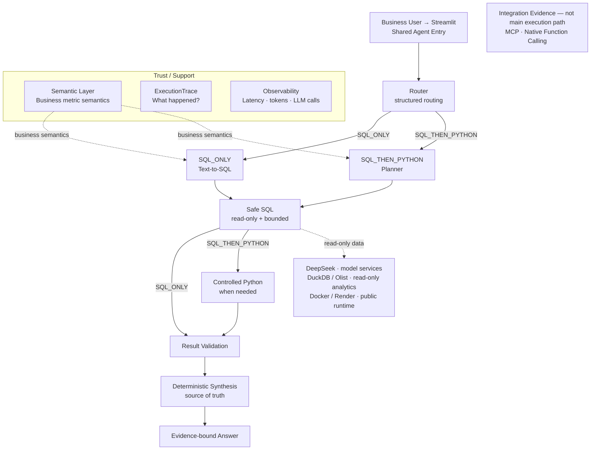

# Simplified Architecture

- Default orchestration: **Explicit Python workflow**.
- Alternative: **LangGraph over the same shared components**.

FastAPI remains a secondary developer/integration entry over the same Agent;
Public V1 uses Streamlit on Render.

The detailed engineering and deployment view remains in
[`architecture.md`](architecture.md).
